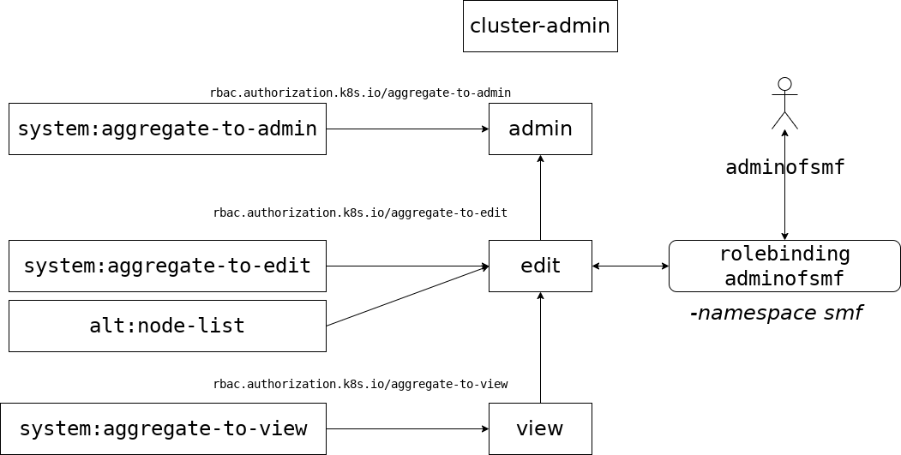

# Настройка рабочих мест администраторов проектов (Role)

## Создание рабочего места администратора проекта smf

Создадим рабочее место администратора проекта (`namespace`) с именем `adminofsmf`.
Для этого установим переменную `USER`:
```
$ export USER=adminofsmf
```
и выполним пункты раздела [Создание рабочих мест и сертификатов](https://gitea.basealt.ru/kaf/RBAC/src/branch/main/addUser/create-user.md) за исключением последнего пункта **Восстановление прав доступа к файлам конфигурации созданного пользователя**.

## Формирование роли и связывание ее с пользователем

Связывание проектных (`namespace`) ролей производится подкомандой `rolebinding`.
При связывании необходимо указать имя проекта (`namespace`) флагом `-n <имя_проекта>`.
Если роль совпадает с кластерной ролью, то при связывании роли можно использовать соответствующую кластерную роль.
```
$ kubectl -n smf create rolebinding adminofsmf --clusterrole=edit --user=adminofsmf
```
Команда создает в `namespace` `smf` связку  `adminofsmf`, привязывающую пользователя `adminofsmf` к кластерной роли `edit` в рамках `namespace` `smf`.



## Проверка привязки роли

```
# переход в контекс пользователя adminofsmf - администратор информационной (автоматизированной) системы
$ kubectl config use-context adminofsmf 
Switched to context "adminofsmf".
# Получение списка Pod'ов в namespace smf
$ kubectl -n smf get pods
NAME   READY   STATUS    RESTARTS   AGE
...
# Получение списка Pod'ов в namespace default
$ kubectl -n default get pods
Error from server (Forbidden): pods is forbidden: User "adminofsmf" cannot list resource "pods" in API group "" in the namespace "default"
# Получение списка узлов
$ kubectl -n smf get nodes
Error from server (Forbidden): nodes is forbidden: User "adminofsmf" cannot list resource "nodes" in API group "" at the cluster scope
# возврат в контекс пользователя kubernetes-admin@kubernetes - администратор безопасности средства контейнеризации
$ kubectl config use-context kubernetes-admin@kubernetes 
```

## Восстановление прав доступа к файлам конфигурации созданного пользователя

В конце не забудьте ужесточить права доступа к файлам  конфигурации созданного пользователя:
```
$ cd ~
$ sudo chmod -R 700 $KUBECONFIGDIR
$ sudo chmod 700 $USERDIR
```


**Ссылки**:
* [Create Role and RoleBinding ](https://kubernetes.io/docs/reference/access-authn-authz/certificate-signing-requests/#create-role-and-rolebinding)